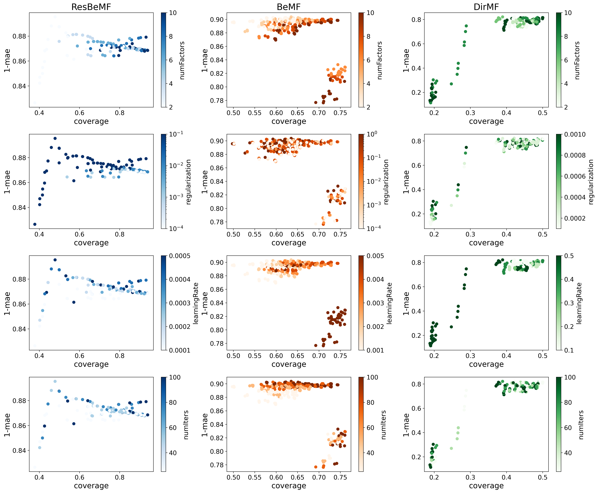

# Restricted Bernoulli Matrix Factorization: Balancing the trade-off between prediction accuracy and coverage in Classification based collaborative filtering

This repository includes the source code for the experiments discussed in the manuscript titled *Restricted Bernoulli Matrix Factorization: Balancing the trade-off between prediction accuracy and coverage in Classification based collaborative filtering*. The manuscript has been submitted to the *International Journal of Interactive Multimedia and Artificial Intelligence* journal. You can access the preprint on [arXiv](https://arxiv.org/abs/2210.10619).

## Random search results

MovieLens 100K:

MovieLens 1M:

FilmTrust:

MyAnimeList:

MyAnimeList:

## Pareto front:

## Test error:

Matrix factorization based collaborative filtering:

Artificial neural network based collaborative filtering:

> To reproduce the experiments from this research, unzip the prediction files into the preds/gmcm and preds/mwgp directories.

