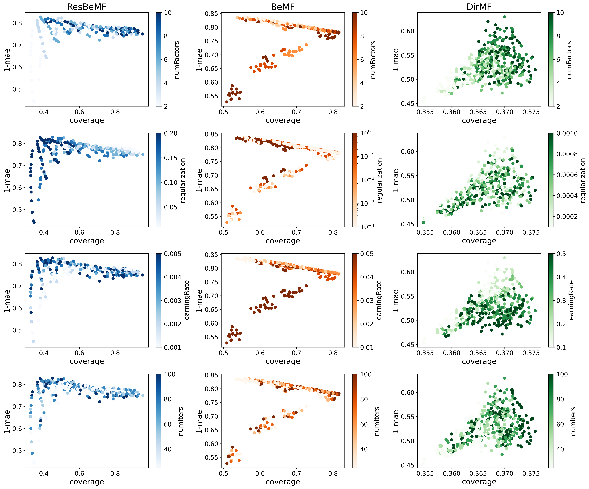
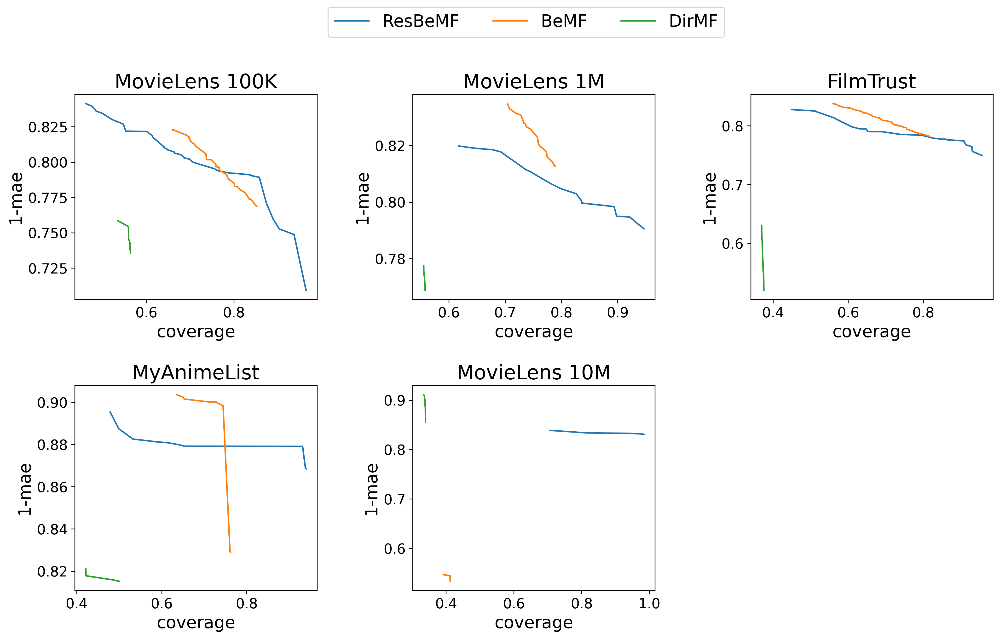
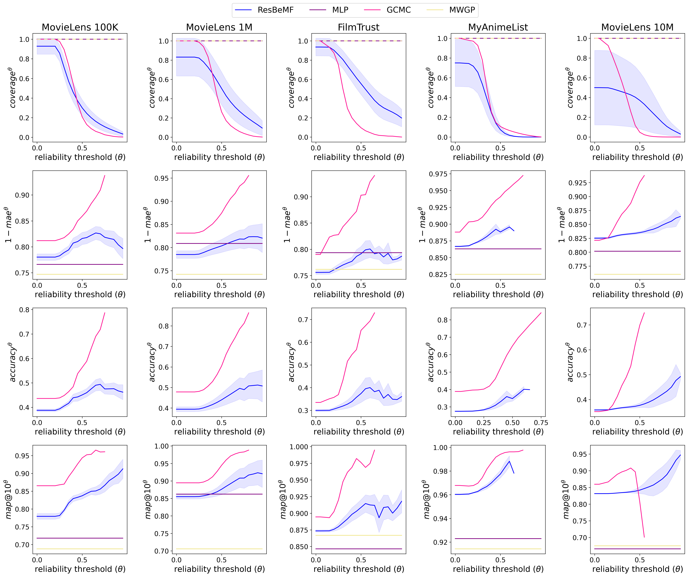

# Restricted Bernoulli Matrix Factorization: Widening the trade-off between prediction accuracy and coverage in Classification based Collaborative Filtering

This repository includes the source code for the experiments discussed in the manuscript titled *Restricted Bernoulli Matrix Factorization: Widening the Trade-off between Prediction Accuracy and Coverage in Classification-based Collaborative Filtering*. The manuscript has been submitted to the *Knowledge-Based Systems* journal. You can access the preprint on .

## Random search results

MovieLens100K:

## Pareto front:

## Test error:

Matrix factorization based collaborative filtering:

Artificial neural network based collaborative filtering:

